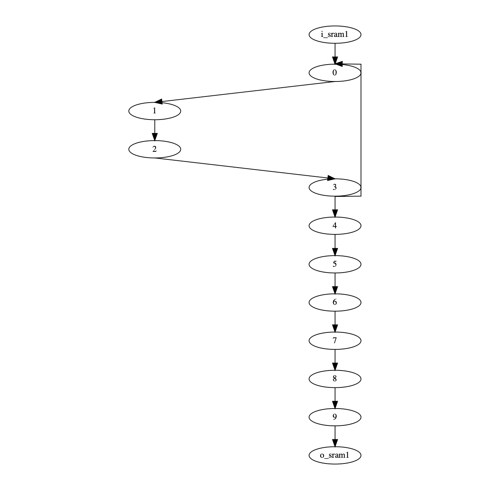
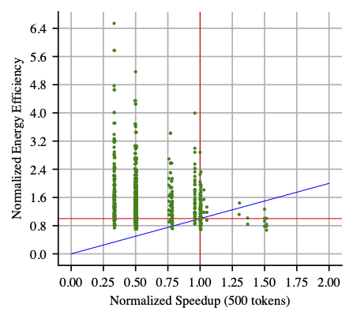

Ultra-Elastic CGRAs -- Analytical Model and Compiler Power-Mapping Pass
==========================================================================

This directory contains the analytical modeling described in
**Section II** (including the discrete-event simulator and the
energy model) as well as the compiler power-mapping pass described
in **Section III**.

You can run the following types of tasks with the models in this
directory:

- Plotting and Visualizing the DFGs
- Exhaustive Search of Voltage/Frequency Configuration Space
- Compiler Power-Mapping Pass

Getting Started
--------------------------------------------------------------------------

Make sure your environment is set up with the following python
packages:

    % mkdir $HOME/venv
    % python3 -m venv $HOME/venv
    % source $HOME/venv/bin/activate

    % pip install doit
    % pip install numpy
    % pip install matplotlib

Plotting and Visualizing the DFGs
--------------------------------------------------------------------------

The first thing you can do is to plot and visualize the DFGs for
each kernel, including the toy DFG constructed manually in dfgs.py
(feel free to build your own DFGs here too):

    % python plot-bf.py
    % python plot-dither.py
    % python plot-fft.py
    % python plot-llist.py
    % python plot-susan.py
    % python plot-toy.py

For example, the toy kernel looks like this:

Exhaustive Search of Voltage/Frequency Configuration Space
--------------------------------------------------------------------------

You can also run an exhaustive search on a DFG, generating a plot
like the one shown in **Figure 3** of the paper. The
`task_explore.py` file generates doit tasks for each green dot in
the space, and you can run all of them with `doit explore` as shown
below. Instead of using make, we use a Python-based build tool
called doit (https://pydoit.org) to flexibly describe launching
simulations for the very large space:

    % doit list
    % doit list --all

    % doit explore
    % doit -n4 explore

    % python plot-explore.py

This will give you a plot that looks like this:

Compiler Power-Mapping Pass
--------------------------------------------------------------------------

The compiler power-mapping pass heuristically searches a subset of
the space for a good performance-energy point. This code corresponds
to the three-phase algorithm described in **Section III** of the
paper.

This pass requires the CGRA configurations found in
`uecgra-src/benchmark/evaluation`, so make sure the `jsons` symlink
is pointing there. These JSON CGRA configurations describe all PEs
including their xy locations, operators, sources and destinations
for the streaming data in and out, and for any data routing through
the busy PEs. The specific goal of this power-mapping pass is to add
an additional field to this configuration json for the assigned DVFS
power mode (i.e., either rest, nominal, or sprint).

Try running the performance-optimized mapping for the ``toy`` DFG
like this:

    % python map-toy.py

You will see a printed log of each step in the heuristic iterative
process. You will also see an analytical power breakdown of the
entire CGRA running that kernel. Note that the heuristic pass can be
fairly quick (a few seconds) but it may also take tens of minutes
depending on the size of the DFG. The final new json will be
produced with the power modes corresponding to the configuration
found with the best energy-delay product.

You will see an output like this:

    1:      throughput --                 0.27
    1:         latency --               187.00
    1:           power --              3478.18
    1:          energy --            650419.77

    2:      throughput --                 0.35
    2:         latency --               147.00
    2:           power --              4114.07
    2:          energy --            604768.50

    X:      throughput --                 1.27
    X:         speedup --                 1.27
    X:           power --                 1.18
    X:            eeff --                 1.08

It is important to note that the numbers we produce here are only
meaningful _relative_ to each other. In this printout, you will see
numbers printed for (1) the CGRA with no DVFS, (2) the CGRA with
newly configured voltage-frequency pairs assigned, and (X) the
relative factors for the latter over the former.

For the toy DFG, the mapping produces a throughput benefit of 1.27x
in addition to an energy efficiency benefit of 1.08x.

You can run all the performance-optimized mapping passes like this:

    % python map-toy.py
    % python map-bf.py
    % python map-dither.py
    % python map-fft.py
    % python map-llist.py
    % python map-susan.py

Or you can run the energy-optimized mapping passes like this ("eeff"
stands for energy-efficient):

    % python map-toy-eeff.py
    % python map-bf-eeff.py
    % python map-dither-eeff.py
    % python map-fft-eeff.py
    % python map-llist-eeff.py
    % python map-susan-eeff.py

The analytical results are very similar but do not exactly match
those of our RTL simulations because our discrete-event performance
model implements an eager fork but the RTL does not.

